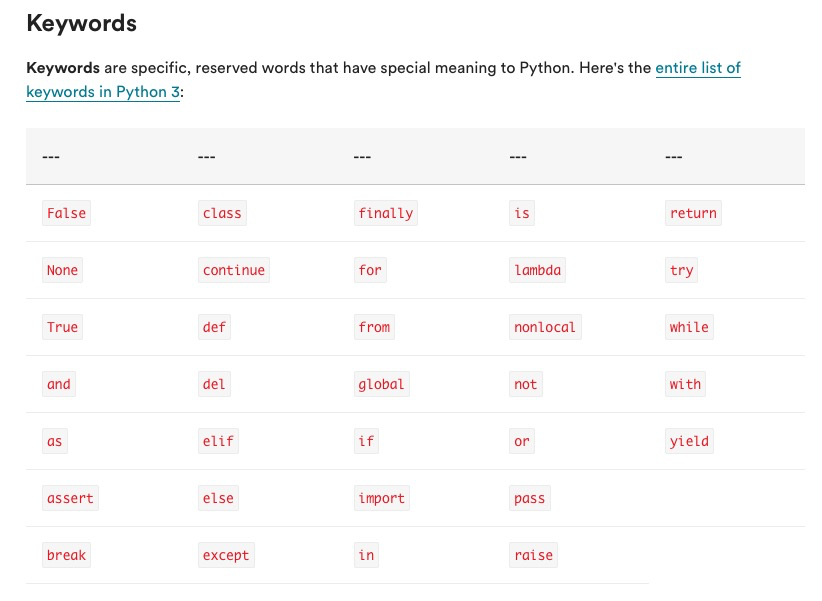
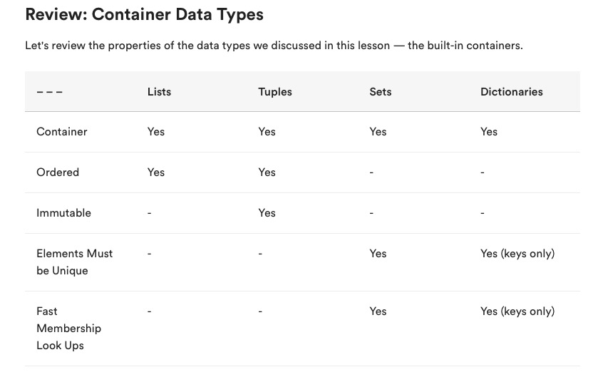

# GA Pre - Work Notes

[TOC]


## GA: Python Basics


### Reserved Python Keywords

https://docs.python.org/3/reference/lexical_analysis.html#keywords




## Container Data Types




## GA: Python Tools for Data Science


### Pandas

[pandas.DataFrame — pandas 0.25.1 documentation](https://pandas.pydata.org/pandas-docs/stable/reference/api/pandas.DataFrame.html)


### Matplotlib and seaborne

`fig, ax = plt.subplots()`


## GA: Intermediate Python

The `*args` keyword is transformed into a tuple with all of the arguments provided that can be iterated through, example:

``` python
def adder(*args):
    total = 0
    print('args:', args)
    for arg in args:
        total += arg
    return total
```

`**kwargs` is a similar concept but for keyword arguments and puts the arguments provided into a dictionary


## Maths Descriptive vs. Inferential Statistics

**Descriptive** - focus on summarizing, describing and understading the data we observe

**Inferential statistics** - focus on generalizing the results from a sample to a popultation


### Covariance and Correlation

**The formula for covariance is given by the below**
$$
s_{XY} = \frac{1}{n-1}\sum^n_{i=1}(x_i - \bar{x})(y_i - \bar{y})
$$
Covariances can take on any real value, positive, zero or negative

- Values greater than zero indicate positive linear relationship
- Values close to zero indicate little to no linear relationship between variables

**Pearson's correlation coefficent $r_{XY}$**
$$
r_{XY} = \frac{1}{n-1}\sum^n_{i=1}{\left(\frac{x_i - \bar{x}}{S_X}\right)\left(\frac{y_i - \bar{y}}{S_Y}\right)}
$$
Covariances can take on value between +1 and -1


### Multicollinearity

Is a concept which exists when there are a high number of intercorrelations or inter-associations among independent variables. This can causes problems for machine learning models.

It can be avoided by using **feature selection** which is the process of narrowing down the number of features in a data set to focus solely on those that are important and necessary. 


### Correlation and Covariance in Python

```python
print(np.cov(x,y) )       ## Prints the covariance matrix.
print(np.corrcoef(x,y))   ## Prints the correlation matrix.
```


### Other Correlation Measuers

**Kendall Rank Correlation** - ordinal assocation between two measuered qunantities

**Spearman's Rank Correlation** - Degrees of association between two variables


### More Information

http://www.mathsisfun.com/data/correlation.html


## Fundamentals of Probablility


### Axioms of Probablility and Bayes Theorem

Study Notes: [Fundamentals of Probability - Axioms of Probablility and Bayes Theorem](evernote:///view/201064069/s353/1fee377f-9586-42e8-933b-35795604a9a2/1fee377f-9586-42e8-933b-35795604a9a2/)

* **Experiment** - A procedure that can be repeated an indefinite amout of times and has a well-defined set of outcomes

* **Sample Space** - the set of all possible outcomes of an experiment denoted by $S$

* **Event** - any collection of outcomes of an experiment

* **Set** - a well-efined collection of distinct objects
* **Element** - An object that is a member of a set 


#### Kolmogorov's axioms of Probability

1. For Any event: $A, P(A) \geq 0$

2. For any sample space: $S, P(S) = 1$, that is the prbability of an outcome occuring in the sample space is 1
3. For mutualy exclusive events: $A_1, A_2,..., P(\cup^P_{i=1}A_i = \sum^\infin_{i=1}A_i)$, this means that for a series of events that are mutually exclusive the probablity of a untion of those events is the sum of the probablilites of the individual event


3. Cont, Probablity of heads union tales when flipping a coin = $P(heads) + P(tails)$


#### Bayes Theorem

$$
P(A|B) = \frac{P(A\cap B)}{P(B)} = \frac{P(B|A)P(A)}{P(B)}
$$

#### Total Probability

$$
P(S) = P(S|M)P(M) + P(S|I)P(I)
$$

#### More Information

https://www.mathsisfun.com/data/bayes-theorem.html


### Combinations and Permutations

- Premutation is an arrangemnt of objects without repetition in which order matters

Formula for permutations is
$$
P(n,k) = \frac{n!}{(n-k)!}
$$

- Combination is an arrangment of objects without repetition in which **ordere doesn't matter**

Formula for Combinations is
$$
C(n,k) = \frac{n!}{(n-k)!k!}
$$


## Vectors and Matrices

Vectorizing data = the process of transforming non numberical features to numeric ones

In Regression models the bias is the value where all variables are 0 which is not possible to have with one hot encoding so interpreting the intercept is difficult

Parametric machine learning models rely on mathematical formuals with unknown coefficients/parameters, such as linear regression, logistic cregression, and neural networks.

Framework for parameteric models

1. **Model**: An equation with coefficents for which to solve
2. **Constraint**: Used to know how "good" a set of coefficents are
3. **Optimisation tehcnique**: Finds the ideal coefficients

Can store **sparse** vectors (ones that have many more 0s than 1s) by storing the positions of the non-zero items

Dot Product
$$
a.b = ||a||||b|| cos(\theta)
$$